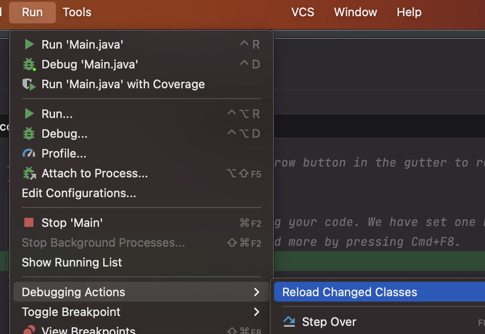

Java development has plenty of tips and shortcuts that can simplify your coding experience. In this post, I'll share some cool tips I've picked up from the different people I've worked with, as well as from online resources, books and conferences.
<!--more-->

## 1. Don't restart your server after you modify a class

Starting up a Spring boot application can take some time especially with all the dependencies and database connections your project may involve it can easily take more than 30 seconds per startup. 

When you're fixing a bug or just checking how your server works, you typically make changes to the code and might feel inclined to restart the server to see if those changes resolve the issue. However, there's no need to restart the server for your changes to take effect. You can just recompile the specific classes you changed, without having to restart everything.

From <a href="https://www.jetbrains.com/help/idea/altering-the-program-s-execution-flow.html#reload_classes">Intellij's documentation: </a>

  
You can reload a single file

 <li>Right-click in the editor tab of the modified file and select <b>Compile and Reload File</b>. </li>

  
You can also reload all modified files

 <li>In the main menu, go to <b> Run | Debugging Actions | Reload Changed Classes </b> .</li>

 
Keep in mind there are some <a href="https://www.jetbrains.com/help/idea/altering-the-program-s-execution-flow.html#hotswap-limitations">Hotswap limitations</a>. It will only work with non-structural code changes (changing an implementation of a method). HotSwap will not work when you change the class members or method signatures.
