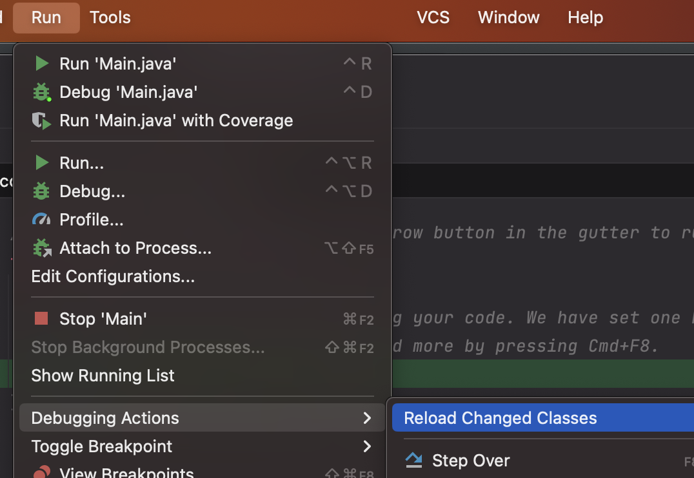

IntelliJ IDEA offers a lot of powerful features that make development easier. In this post, I'm sharing some great tips I've learned from others, that I've found to increase my productivity.
<!--more-->

## 1. Don't restart your server after you modify a class

Starting a Spring Boot application can take a while, and restarting it after each class change during debugging can add up to a lot of wasted time.

When you're fixing a bug or just checking how your server works, you typically make changes to the code and might feel inclined to restart the server to see if those changes resolve the issue. However, there's no need to restart the server for your changes to take effect. You can just recompile the specific classes you changed, without having to restart everything.

From <a href="https://www.jetbrains.com/help/idea/altering-the-program-s-execution-flow.html#reload_classes">IntelliJ's documentation: </a>

  
You can reload a single class

 <li>Right-click in the editor tab of the modified file and select <b>Compile and Reload File</b>. </li>

  
You can also reload all modified classes

 <li>In the main menu, go to <b> Run | Debugging Actions | Reload Changed Classes </b> .</li>

 
Keep in mind there are some <a href="https://www.jetbrains.com/help/idea/altering-the-program-s-execution-flow.html#hotswap-limitations">Hotswap limitations</a>. It will only work with non-structural code changes (changing an implementation of a method). HotSwap will not work when you change the class members or method signatures.

Given you'll spend most of your time debugging as a developer, I highly recommend the entire 'Debugging' section from Intellij's documentation, especially the <a href="https://www.jetbrains.com/help/idea/altering-the-program-s-execution-flow.html">Alter the program's execution flow</a> part.

## 2. Debugging backwards by exploring previous stack frames

Suppose you're debugging and have set breakpoints in two methods: a() and b(). You're inspecting b() but suddenly realize you need to review something in a() again. Instead of restarting the debug process, you can simply jump back to a() to re-examine what happened there. This saves you time by letting you quickly revisit previous steps without having to go through everything again.

  
You are currently in b()

 <li>You want to go back to a() so you click <b>Reset Frame</b>. </li>

  
Now you are in a()

## 3. Resolving dependency issues with maven helper plugin

Managing dependencies in Java can get tricky, especially when there are conflicts. The <a href="https://plugins.jetbrains.com/plugin/7179-maven-helper">Maven Helper plugin </a> can be a big help here. It shows you where the conflicts are and lets you fix them fast.

For example, if you have two versions of a logging library that are causing problems, Maven Helper will point them out. You can then decide which version to keep, clearing up the conflict without having to dig through your project files manually.

## 4. Narrow down searches with file Masks

When looking for a word in your project, test files often show up too much in the results. To fix this you can use file masks. This allows you to tell IntelliJ which files you want to include or exclude in your search.

For example, if you're trying to search for "user" but want to exclude test files, just apply the `!*Test.java` file mask in your search. This filters out any files with 'Test.java' in their name, streamlining your results.

  
Search without file mask

  
Search with file mask

 
You can also customise the `File Mask` value to your liking and exclude multiple file extensions.
