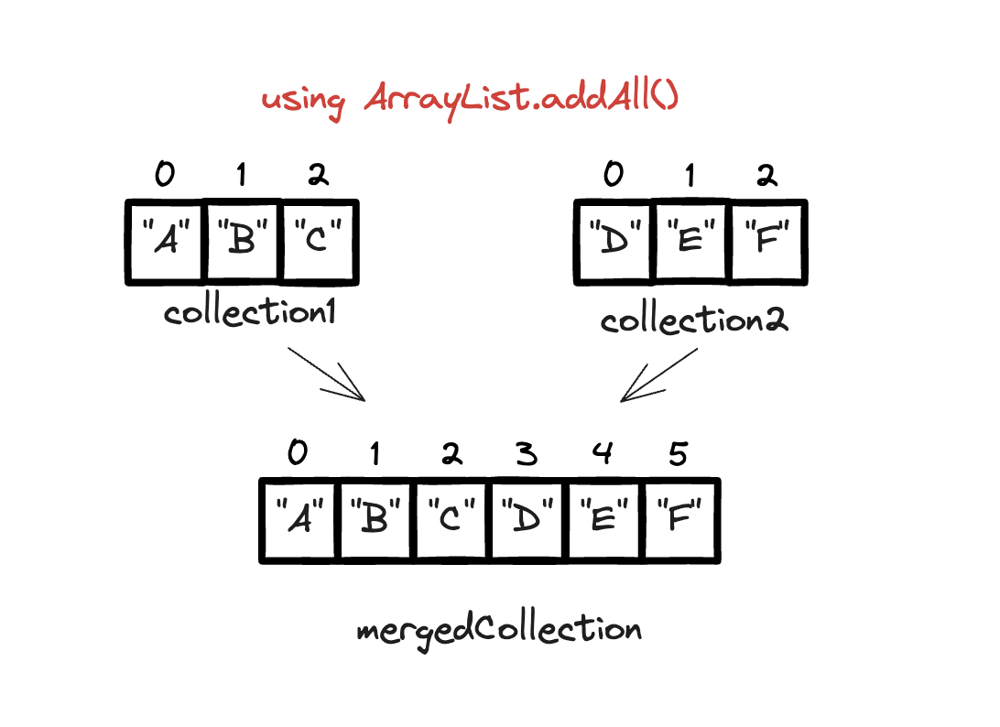
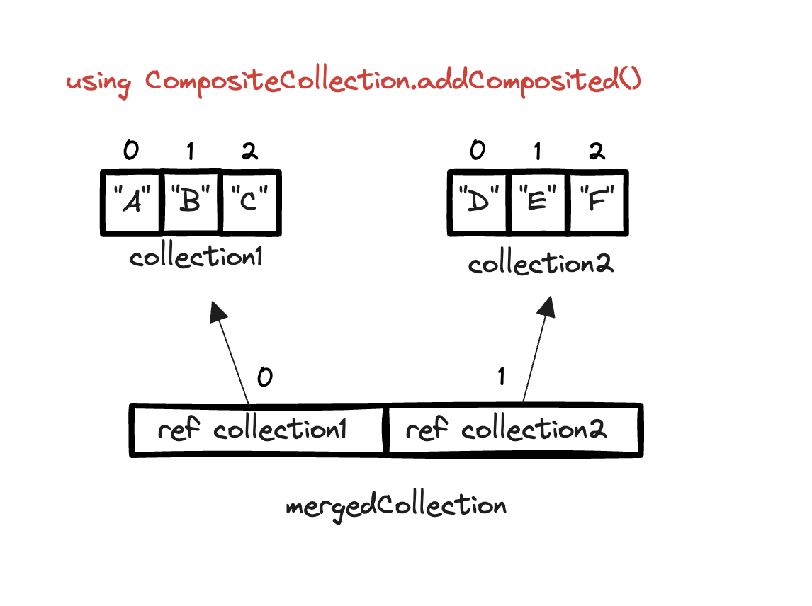
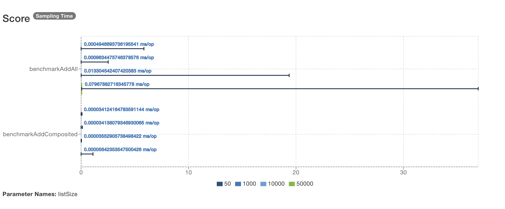
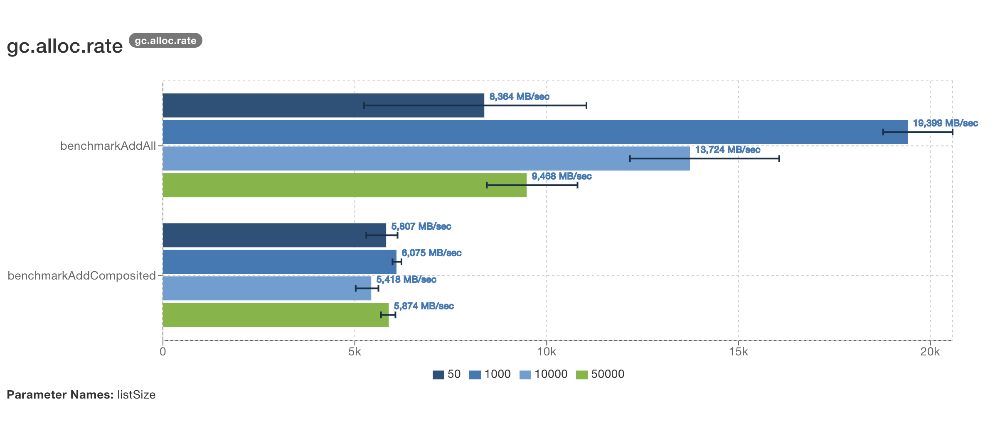
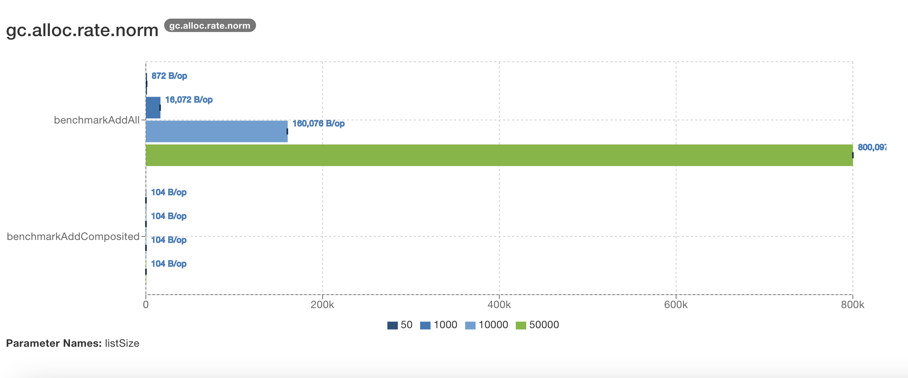
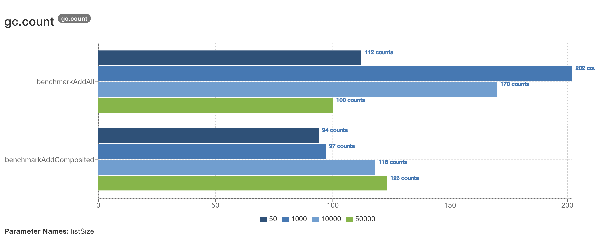
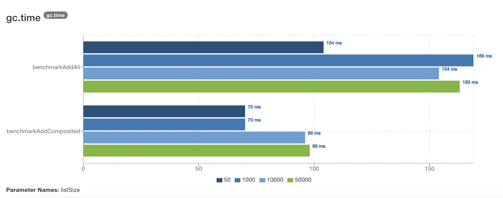

When you need to merge multiple collections for read-only access in a memory-sensitive program, choosing the right method can be crucial. Common methods include Stream.concat, Stream.of, and Collection.addAll. 

<!--more-->

In this post, we'll explore why CompositeCollection from Apache Commons Collections is the best option for read-only access. We will also benchmark both CompositeCollection and addAll to compare their performance and memory efficiency, providing detailed results on memory savings and execution times.

## Table of Contents
- [Common Ways of Merging Collections](#1-common-ways-of-merging-collections)
- [Problem: High memory usage](#2-problem-high-memory-usage)
- [A Better Approach with CompositeCollection](#3-a-better-approach-with-compositecollection)
- [Performance Comparison: CompositeCollection vs. addAll](#4-performance-comparison-compositecollection-vs-addall)
- [Results](#results)
- [Conclusion](#conclusion)

## 1. Common Ways of Merging Collections

Merging collections is a frequent task in Java. Here are the most common methods:

Suppose you have the following collections you need to merge into one:


Collection<String> collection1 = Arrays.asList("A", "B", "C");
Collection<String> collection2 = Arrays.asList("D", "E", "F");


### 1.1 Using Stream.concat


Collection<String> mergedCollection = Stream.concat(collection1.stream(), 
                                                        collection2.stream())
                                            .collect(Collectors.toList());


This can get really bad if you're concatenating an arbitrary number of lists, as per the `concat` javadoc:

    Use caution when constructing streams from repeated concatenation. 
    Accessing an element of a deeply concatenated stream can result in 
    deep call chains, or even StackOverflowError. Subsequent changes to
    the sequential/parallel execution mode of the returned stream 
    are not guaranteed to be propagated to the input streams.

### 1.2 Using Stream.of


Collection<String> mergedCollection = Stream.of(collection1, collection2)
                                            .flatMap(Collection::stream)
                                            .collect(Collectors.toList());


### 1.3 Using addAll


Collection<String> mergedCollection = new ArrayList<>(collection1);
mergedCollection.addAll(collection2);


## 2. Problem: High memory usage

All the above solutions require copying all elements into a new collection. This duplication of elements increases memory usage, which can be problematic in memory-sensitive applications.

This is what happens:

1. A new ArrayList (mergedCollection) is created.
2. Elements from collection1 are copied into mergedCollection during initialization.
3. Elements from collection2 are copied into mergedCollection using addAll.

Memory usage increases because all elements are duplicated in the new collection.

## 3. A Better Approach with CompositeCollection

`CompositeCollection` from Apache Commons Collections provides an efficient way to create a read-only view over multiple collections without duplicating elements. Instead of creating a new collection and copying all the elements into it, `CompositeCollection` keeps references to the original collections.



Collection<String> collection1 = Arrays.asList("A", "B", "C");
Collection<String> collection2 = Arrays.asList("D", "E", "F");

CompositeCollection<String> allRecords = new CompositeCollection<>();
allRecords.addComposited(collection1, collection2);


Visualized: 

     

1. A new CompositeCollection (mergedCollection) is created.
2. References to collection1 and collection2 are added to mergedCollection using addComposited.
3. No elements are copied; instead, mergedCollection maintains references to the original collections.

### Benefits of CompositeCollection

- **Memory Efficiency**: `CompositeCollection` does not duplicate elements. Instead, it references the original collections, saving memory.
- **Read-Only View by Default**: By default, `CompositeCollection` provides a read-only view of the combined collections unless a `CollectionMutator` strategy is specified.
- **Flexibility**: If you need to modify the `CompositeCollection`, you can specify a `CollectionMutator` strategy to support add, remove, and other modification operations.

## 4. Performance Comparison: CompositeCollection vs. addAll

### Objective

The main goal here is to test the hypothesis that `CompositeCollection` is more efficient in terms of execution time and memory usage compared to the traditional `addAll` method when merging collections. This experiment aims to provide solid evidence to support or refute this hypothesis.

### Methodology

To evaluate the efficiency of `CompositeCollection` against `addAll`, I’m using the <a href="https://www.baeldung.com/java-microbenchmark-harness">Java Microbenchmark Harnesss</a> (JMH). JMH is a Java library specifically designed for benchmarking code, providing accurate and reliable performance measurements. Using JMH helps mitigate common benchmarking pitfalls, like JVM optimizations and warm-up times, ensuring the results are robust and reproducible.

### Experimental Setup

The benchmark tests cover a range of list sizes to simulate various real-world scenarios. The list sizes are defined by the `@Param` annotation in the JMH test, specifically:

- Small lists: 50 elements
- Medium lists: 1,000 elements
- Large lists: 10,000 elements
- Extra-large lists: 50,000 elements

### Parameters and Benchmark Modes

The JMH parameters and modes are configured as follows:

- **Benchmark Mode:** `Mode.AverageTime` and `Mode.SampleTime`
  - `Mode.AverageTime` measures the average time taken for the benchmarked method to execute.
  - `Mode.SampleTime` measures the time taken for individual samples of the benchmarked method, providing a distribution of execution times.
- **Output Time Unit:** `TimeUnit.MILLISECONDS`
  - The results are reported in milliseconds for precision.
- **Forks, Warmups, and Measurements:**
  - **Fork:** 1 (the benchmark process is forked once to minimize JVM startup costs)
  - **Warmup Iterations:** 5 iterations, each lasting 1 second, to allow the JVM to optimize the code.
  - **Measurement Iterations:** 5 iterations, each lasting 1 second, to gather performance data after the warm-up phase.

### Implementation Details

The benchmark test includes two primary methods:

- `benchmarkAddAll`: This method merges two collections using the traditional `addAll` approach.
- `benchmarkAddComposited`: This method merges the collections using `CompositeCollection` from the Apache Commons Collections library.

Each method is annotated to be benchmarked under the same conditions, ensuring a fair comparison.

For the sake of reproducible software, the code and results can be found here: [GitHub Repository](https://github.com/).

We can also visualize the results by dragging the benchmark-results.json file into [JMH Visualizer](https://jmh.morethan.io/).

  
Code

 
package benchmark;

import org.apache.commons.collections4.collection.CompositeCollection;
import org.openjdk.jmh.annotations.Benchmark;
import org.openjdk.jmh.annotations.BenchmarkMode;
import org.openjdk.jmh.annotations.Fork;
import org.openjdk.jmh.annotations.Measurement;
import org.openjdk.jmh.annotations.Mode;
import org.openjdk.jmh.annotations.OutputTimeUnit;
import org.openjdk.jmh.annotations.Param;
import org.openjdk.jmh.annotations.Scope;
import org.openjdk.jmh.annotations.Setup;
import org.openjdk.jmh.annotations.State;
import org.openjdk.jmh.annotations.Warmup;
import org.openjdk.jmh.results.format.ResultFormatType;
import org.openjdk.jmh.runner.Runner;
import org.openjdk.jmh.runner.options.Options;
import org.openjdk.jmh.runner.options.OptionsBuilder;

import java.util.ArrayList;
import java.util.Collection;
import java.util.concurrent.TimeUnit;

@State(Scope.Benchmark)
@BenchmarkMode(Mode.SampleTime)
@OutputTimeUnit(TimeUnit.MILLISECONDS)
@Fork(value = 1, warmups = 1)
@Measurement(iterations = 5, time = 1)
@Warmup(iterations = 2, time = 1)
public class CollectionBenchmark {

    @Param({"50", "1000", "10000", "50000"})
    private int listSize;

    private Collection<String> collection1;
    private Collection<String> collection2;

    // Setup method to initialize collections before each benchmark
    @Setup
    public void setup() {
        collection1 = new ArrayList<>(listSize);
        collection2 = new ArrayList<>(listSize);
        for (int i = 0; i < listSize; i++) {
            collection1.add("A" + i);
            collection2.add("B" + i);
        }
    }

    // Benchmark method for the addAll approach
    @Benchmark
    public Collection<String> benchmarkAddAll() {
        Collection<String> mergedCollection = new ArrayList<>(collection1);
        mergedCollection.addAll(collection2);
        return mergedCollection;
    }

    // Benchmark method for the CompositeCollection approach
    @Benchmark
    public Collection<String> benchmarkAddComposited() {
        CompositeCollection<String> mergedCollection = new CompositeCollection<>();
        mergedCollection.addComposited(collection1, collection2);
        return mergedCollection;
    }

    // Main method to run the benchmark
    public static void main(String[] args) throws Exception {
        Options opt = new OptionsBuilder()
                .include(CollectionBenchmark.class.getSimpleName())
                .forks(1)
                .addProfiler("gc")
                .resultFormat(ResultFormatType.JSON)
                .result("benchmark-results.json")
                .build();

        new Runner(opt).run();
    }
}



## Results

The benchmark tests covered four different list sizes: 50, 1,000, 10,000, and 50,000 elements. Each test was executed to compare the performance of two methods: `addAll` and `CompositeCollection`.

To interpret the results of the benchmark, it is essential to understand the various metrics used and what they signify. Here's a brief explanation of each metric and its significance:

#### Average Execution Time (ms/op)

This metric indicates the average time taken for the benchmarked method to execute one operation, measured in milliseconds per operation (ms/op). It's useful for understanding the typical performance of the method.

For example, if `benchmarkAddAll` for a parameter list size of 50 (total 100 elements) has an average execution time of ≈ 10⁻³ ms/op, it means each operation takes approximately 0.001 milliseconds to complete.

  
Table View - Average Execution Time (ms/op)

  <table>
    <tr>
      <th>List Size</th>
      <th><code>benchmarkAddAll</code> (ms/op)</th>
      <th><code>benchmarkAddComposited</code> (ms/op)</th>
    </tr>
    <tr>
      <td align="center">50</td>
      <td align="center">≈ 10⁻³</td>
      <td align="center">≈ 10⁻⁴</td>
    </tr>
    <tr>
      <td align="center">1,000</td>
      <td align="center">0.001 ± 0.001</td>
      <td align="center">≈ 10⁻⁴</td>
    </tr>
    <tr>
      <td align="center">10,000</td>
      <td align="center">0.013 ± 0.001</td>
      <td align="center">≈ 10⁻⁴</td>
    </tr>
    <tr>
      <td align="center">50,000</td>
      <td align="center">0.080 ± 0.004</td>
      <td align="center">≈ 10⁻⁴</td>
    </tr>
  </table>

#### GC Allocation Rate (MB/sec)

This metric shows the rate at which memory is allocated by the garbage collector (GC) during the benchmark, measured in megabytes per second (MB/sec). A higher rate indicates more frequent memory allocation, which can impact performance.

For example, if `benchmarkAddAll` for a parameter list size of 50 (total 100 elements) has a GC allocation rate of 8364.156 MB/sec, it means the GC is allocating 8364.156 megabytes of memory per second.

  
Table View - GC Allocation Rate (MB/sec)

  <table>
    <tr>
      <th>List Size</th>
      <th><code>benchmarkAddAll</code> (MB/sec)</th>
      <th><code>benchmarkAddComposited</code> (MB/sec)</th>
    </tr>
    <tr>
      <td align="center">50</td>
      <td align="center">8364.156 ± 8675.603</td>
      <td align="center">5806.512 ± 1337.931</td>
    </tr>
    <tr>
      <td align="center">1,000</td>
      <td align="center">19399.329 ± 2669.796</td>
      <td align="center">6074.513 ± 349.277</td>
    </tr>
    <tr>
      <td align="center">10,000</td>
      <td align="center">13723.650 ± 6073.363</td>
      <td align="center">5417.748 ± 895.667</td>
    </tr>
    <tr>
      <td align="center">50,000</td>
      <td align="center">9467.641 ± 3269.808</td>
      <td align="center">5874.290 ± 643.533</td>
    </tr>
  </table>

#### GC Allocation Rate Normalized (B/op)

This metric indicates the amount of memory allocated by the GC per operation, measured in bytes per operation (B/op). It provides insight into the memory efficiency of each operation.

For example, if `benchmarkAddAll` for a parameter list size of 50 (total 100 elements) has a GC allocation rate normalized of 872.033 B/op, it means each operation allocates approximately 872 bytes of memory.

  
Table View - GC Allocation Rate Normalized (B/op)

  <table>
    <tr>
      <th>List Size</th>
      <th><code>benchmarkAddAll</code> (B/op)</th>
      <th><code>benchmarkAddComposited</code> (B/op)</th>
    </tr>
    <tr>
      <td align="center">50</td>
      <td align="center">872.033 ± 0.047</td>
      <td align="center">104.003 ± 0.001</td>
    </tr>
    <tr>
      <td align="center">1,000</td>
      <td align="center">16072.248 ± 0.160</td>
      <td align="center">104.003 ± 0.004</td>
    </tr>
    <tr>
      <td align="center">10,000</td>
      <td align="center">160076.227 ± 3.533</td>
      <td align="center">104.003 ± 0.002</td>
    </tr>
    <tr>
      <td align="center">50,000</td>
      <td align="center">800097.032 ± 16.623</td>
      <td align="center">104.004 ± 0.001</td>
    </tr>
  </table>

#### GC Count

These metrics indicate the number of garbage collection (GC) events (GC Count) and the total time spent on GC (GC Time), measured in milliseconds. They provide insight into the overhead introduced by garbage collection during the benchmark.

For example, if `benchmarkAddAll` for a parameter list size of 50 (total 100 elements) has a GC count of 112 and a GC time of 104 ms, it means there were 112 GC events, and the total time spent on GC was 104 milliseconds.

  
Table View - GC Count

  <table>
    <tr>
      <th>List Size</th>
      <th><code>benchmarkAddAll</code> (counts)</th>
      <th><code>benchmarkAddComposited</code> (counts)</th>
    </tr>
    <tr>
      <td align="center">50</td>
      <td align="center">112</td>
      <td align="center">94</td>
    </tr>
    <tr>
      <td align="center">1,000</td>
      <td align="center">202</td>
      <td align="center">97</td>
    </tr>
    <tr>
      <td align="center">10,000</td>
      <td align="center">170</td>
      <td align="center">118</td>
    </tr>
    <tr>
      <td align="center">50,000</td>
      <td align="center">100</td>
      <td align="center">123</td>
    </tr>
  </table>

#### GC Time (ms)

  
Table View - GC Time (ms)

  <table>
    <tr>
      <th>List Size</th>
      <th><code>benchmarkAddAll</code> (ms)</th>
      <th><code>benchmarkAddComposited</code> (ms)</th>
    </tr>
    <tr>
      <td align="center">50</td>
      <td align="center">104</td>
      <td align="center">70</td>
    </tr>
    <tr>
      <td align="center">1,000</td>
      <td align="center">169</td>
      <td align="center">70</td>
    </tr>
    <tr>
      <td align="center">10,000</td>
      <td align="center">154</td>
      <td align="center">96</td>
    </tr>
    <tr>
      <td align="center">50,000</td>
      <td align="center">163</td>
      <td align="center">98</td>
    </tr>
  </table>

## Conclusion

The results of our benchmark tests provide a clear comparison between the traditional `addAll` method and the `CompositeCollection` approach from Apache Commons Collections for merging collections. The data highlights significant differences in performance and resource utilization.

1. **Average Execution Time (ms/op):**
    - `CompositeCollection` consistently demonstrates faster execution times compared to `addAll`. This is particularly evident as the list size increases, where `CompositeCollection` maintains a stable execution time while `addAll`'s time increases.
    - For a list size of 50, `CompositeCollection` is approximately 10 times faster. This ratio increases with larger list sizes.

2. **GC Allocation Rate (MB/sec):**
    - The `addAll` method exhibits higher memory allocation rates, indicating more frequent memory allocations. This can impact performance negatively, especially in memory-constrained environments.
    - `CompositeCollection` shows a lower and more stable allocation rate, suggesting better memory efficiency.

3. **GC Allocation Rate Normalized (B/op):**
    - This metric further emphasizes the efficiency of `CompositeCollection`. The normalized allocation rate for `addAll` is significantly higher across all list sizes.
    - `CompositeCollection` consistently maintains a low memory allocation per operation, highlighting its memory efficiency.

4. **GC Count:**
    - The number of GC events is notably lower for `CompositeCollection`. This means less frequent garbage collection interruptions, which can contribute to better overall application performance.
    - For larger lists (50,000 elements), `CompositeCollection` has a higher GC count than expected. However, the impact of these additional GC events is mitigated by the lower GC time.

5. **GC Time (ms):**
    - The total time spent on garbage collection is lower for `CompositeCollection` across all list sizes.
    - This reduced GC time translates into fewer interruptions and better performance stability.

## Final Thoughts

The benchmark results strongly suggest that `CompositeCollection` is a superior approach for merging collections in Java, particularly in scenarios where both memory efficiency and execution speed are critical. By using `CompositeCollection`, developers can achieve significant performance improvements and memory savings, making it a compelling choice for read-only access to merged collections.

Thanks for reading :)
